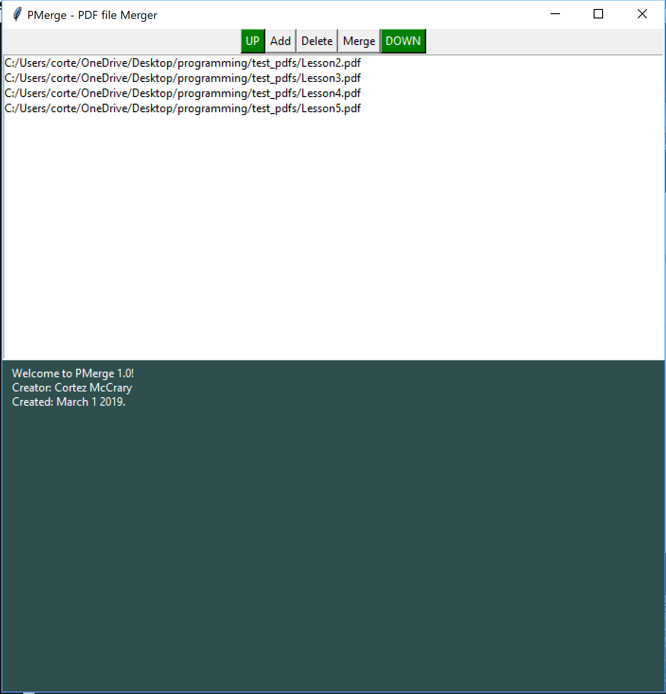

# pMerge

This program takes the commonly used PDFMerge software and adds a Tkinter GUI to it to make it more user friendlly for your none command-line co-workers.

## Motivation
At work, we deal with a lot of paperwork and though I know how to use python scripts to manipulate PDF files most of my co-workers do not. So to help with office productivity, and to knock off some rust on my programming skills, I began this repository.

## ScreenShots

## Tech/Framework
PyPDF2 == 1.26.0
Tkinter == 8.6 
pygubu == 0.9.8.2

## Features
Currently this project only opens PDF files in the order they were imported and allows you to merge the entire files. By the end of this project I would like to create all the features of pyPDF2 has to offer and to include a preview view of the PDFs.

## How to use
python p_merge.py in the project folder will start the GUI. From there click the add button to open up the file browser and add files. Currently the up and down buttons to shift the pdf files around do not work. if you click on the pdf file you will get a basic about of each pdf file in the lower window. while having a file selected selecting delete will delete the file. Finally if you select Merge the file browser will open back up and the files a new file will be created under the given filename.

## Contribution 
contact me at cortez.mccrary.codes@gmail.com.

